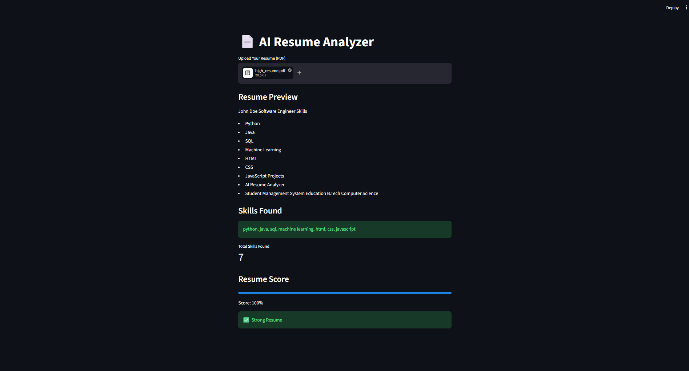

# AI-Resume-Analyzer# AI Resume Analyzer

A simple AI-powered Resume Analyzer built using Python and Streamlit.

## Features

- Upload PDF Resume
- Extract Resume Text
- Detect Skills
- Generate Resume Score
- Resume Evaluation (Strong / Average / Needs Improvement)

## Technologies Used

- Python
- Streamlit
- PDFPlumber

## Application Screenshot

